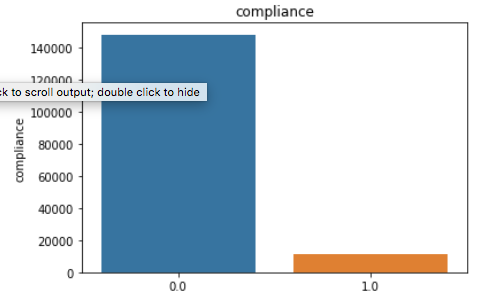
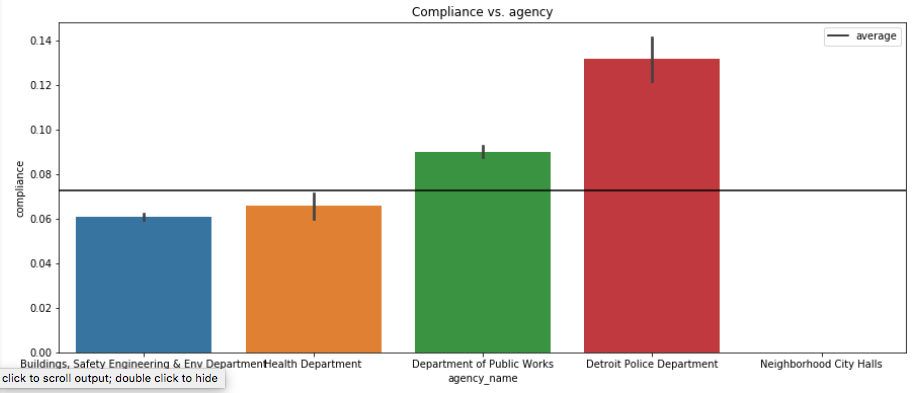
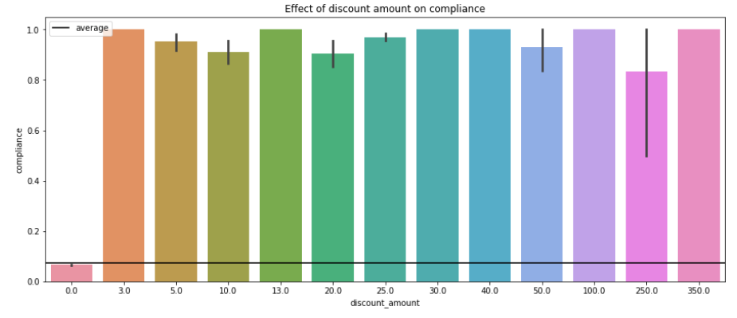

<h1>Project 1: Blight payment prediction</h1>
<ul>
  <li>Project goal: Predict if a fine will be paid or not.</li>
  <li>Project type: Classification</li>
  <li>Data shape: 250306x34</li>
  <li>Models: Naive Bayes, Logistic regression, Support vector classifier, Random forest, XGBoost</li>
  <li>Model evaluation: Area Under the ROC Curve</li>
  <li>Course: University of Michigan Applied Data Science</li>
  <li>Notebook path: UMich_applied_machine_learning/fine_payment_prediction</li>
</ul>

<h3>Insights</h3>
<ul><li>Compliance is quite low in general but some agencies (Police department) have higher compliance rates.
  
  
  </li>        
    <li>Getting any form of discount increases compliance</li>
  
</ul>

<h3>Results</h3>
<table>
    <tr>
        <th>Classifier</th>
        <th>ROC area</th>
    </tr>
    <tr>
        <td>Naive Bayes</td>
        <td>0.76</td>
    </tr>
    <tr>
        <td>Logistic Regression</td>
        <td>0.78</td>
    </tr>
    <tr>
        <td>KNN</td>
        <td>0.73</td>
    </tr>
    <tr>
        <td><strong>Random Forest</strong></td>
        <td><strong>0.83</strong></td>
    </tr>
    <tr>
        <td>SVC (linear)</td>
        <td>0.56</td>
    </tr>
    <tr>
        <td>SVC (rbf)</td>
        <td>0.66</td>
    </tr>    
    <tr>
        <td>Xtreme Gradient Boosting</td>
        <td>0.82</td>
    </tr>
</table> 

